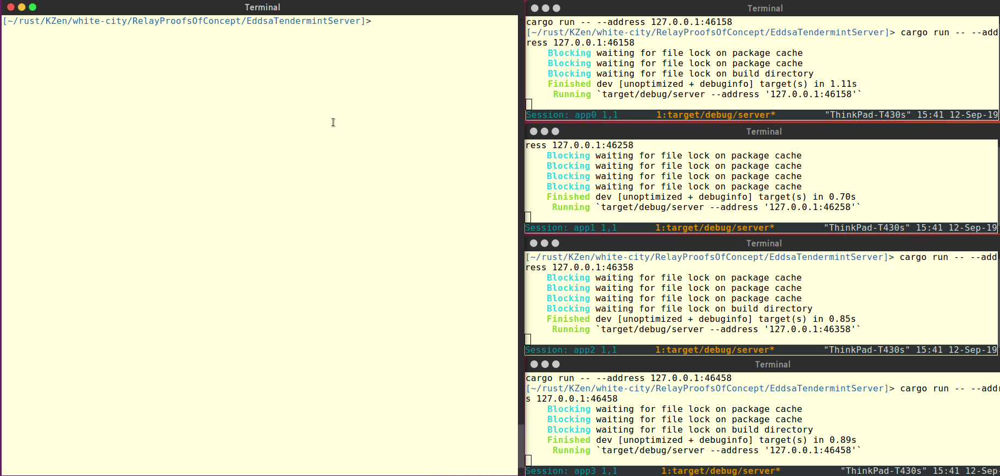

# White-City-Tendermint

This is a POC for running distributed multi-party signatures with Tendermint consensus as a backend for message broadcast

## Build instructions:
Build server and clients:  
`cargo build --all`

## Instructions: Tendermint cluster
Instructions to run a full demo of distributed key generation and n-of-n signing  

### Prerequisites:
* `Tendermint`: Follow the installation guide for your system at [tendermint github](https://github.com/tendermint/tendermint)  
* `tmux`  
* `python`  

### Instructions:
The script `generate.py` takes the number of nodes as a parameter, and generates scripts to run a cluster of Tendermint nodes
The shell scripts are created in a `./tools` directory. 4 Nodes is the default.

1. run `./tools/local-cluster-init.sh` to create a node Testnet configuration
2. run `./tools/local-cluster-start.sh` to start the Tendermint nodes, along with the application servers in separate `tmux` sessions
3. run `./tools/kg-demo.sh` to run key generation. By default, each client is communicating with a random node.
The script takes 2 parameters, the first is the number of nodes (same as in `generate.py`) and the second is the number of participating parties  
For example, if at first `generate.py` was invoked with `python generate.py -n 4`, you can run `./tools/kg-demo.sh 4 12` for 4 nodes and 12 parties.

At the moment, a reset is required after the key gen and before signing
Reset the Tendermint cluster with 

`./tools/local-cluster-reset.sh`  
Then run the signing similarly to key generation, for example:
`./tools/sign-demo.sh 4 12` for 4 nodes and 12 parties

In the demo 5 clients create a threshold signature. A cluster of 4 nodes runs the protocol, after node 3 fails, the protocol still completes successfully.

At technical report is avaialble 
